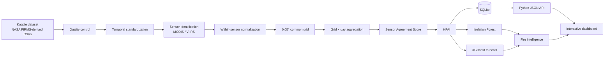

# FIRE-HARMONIX

> Sensor-aware satellite fire intelligence for harmonizing MODIS and VIIRS active-fire observations.

[](https://www.python.org/)
[](https://firms.modaps.eosdis.nasa.gov/)
[](LICENSE)

FIRE-HARMONIX is a NASA Space Apps–style research prototype that converts MODIS and VIIRS thermal detections into a shared spatial and temporal representation. The included dashboard works without a model: users can explore 200 genuine Kaggle/NASA FIRMS observations and generate a transparent Harmonized Fire Activity Index (HFAI). The repository also contains reproducible Isolation Forest and XGBoost feasibility benchmarks.

> **Scientific boundary:** a FIRMS active-fire record is a satellite-detected thermal anomaly. It is not automatically a confirmed wildfire. HFAI, agreement scores, anomaly classes, and forecasts in this repository are project-defined research outputs—not official NASA products or emergency guidance.

## What is included

- Interactive global observation map with MODIS/VIIRS filtering
- 200-record source sample in CSV and SQLite
- Sensor-aware brightness and FRP normalization
- Shared `0.05° × 0.05°` grid identifiers
- Project-defined Sensor Agreement Score and HFAI
- Burning Activity Calendar and critical-period ranking
- No-model Scenario Lab for traceable observation-level outputs
- Reproducible Isolation Forest anomaly benchmark
- Reproducible XGBoost next-day activity benchmark
- Serialized benchmark artifacts, metrics, and model manifest

## System architecture



### Runtime architecture

```mermaid
flowchart TB
    subgraph Browser
      UI[HTML + CSS + JavaScript]
      VIEWS[Map / calendar / scenario lab]
      UI --> VIEWS
    end
    subgraph Python
      API[ThreadingHTTPServer]
      ROUTES[/api/summary<br/>/api/observations<br/>/api/observations/:id]
      API --> ROUTES
    end
    subgraph Storage
      DB[(fire_harmonix.db)]
      CSV[fire_samples.csv]
      MODELS[Versioned model artifacts]
    end
    UI <--> API
    ROUTES --> DB
    CSV --> DB
    MODELS -. future inference integration .-> API
```

## Data source

The sample is deterministically selected from the public [NASA FIRMS Active Fire Dataset (MODIS/VIIRS) on Kaggle](https://www.kaggle.com/datasets/vijayveersingh/nasa-firms-active-fire-dataset-modisviirs/data), derived from NASA FIRMS products.

| Source file | Instrument | Satellite | Sample rows |
|---|---|---|---:|
| `fire_nrt_M-C61_565334.csv` | MODIS | Terra / Aqua | 67 |
| `fire_nrt_J1V-C2_565335.csv` | VIIRS | NOAA-20 | 67 |
| `fire_nrt_SV-C2_565336.csv` | VIIRS | Suomi-NPP | 66 |

All 14 original observation fields are preserved: latitude, longitude, brightness, scan, track, acquisition date/time, satellite, instrument, confidence, version, background brightness, FRP, and day/night flag. Derived fields are added separately. NASA describes MODIS active-fire products at approximately 1 km resolution and VIIRS products at approximately 375 m, so raw counts are not treated as directly equivalent.

## Methodology

### 1. Quality control

1. Validate latitude in `[-90, 90]` and longitude in `[-180, 180]`.
2. Require spatial, temporal, sensor, and satellite fields.
3. Remove exact duplicate observations only.
4. Preserve the original fields before feature engineering.

### 2. Temporal standardization

`acq_date` and zero-padded `acq_time` are combined into UTC timestamps. Calendar features include year, month, week, hour, day of year, and season. The intended analytical unit is **grid × day**, not an isolated satellite pixel.

### 3. Sensor-specific normalization

Brightness and FRP are standardized inside each sensor group:

$$z_{i,s} = \frac{x_{i,s} - \mu_s}{\sigma_s}$$

Here, $s$ is MODIS or VIIRS. This reduces the risk that a model learns sensor identity instead of physical activity.

### 4. Common spatial grid

For resolution $r = 0.05°$:

$$g_{lat}=\left\lfloor\frac{latitude}{r}\right\rfloor, \qquad g_{lon}=\left\lfloor\frac{longitude}{r}\right\rfloor$$

$$grid\_id = g_{lat}\;\Vert\;\_\;\Vert\;g_{lon}$$

Both sensors can then be summarized inside the same spatial unit.

### 5. Sensor Agreement Score

For normalized MODIS activity $M$ and VIIRS activity $V$:

$$Agreement = 1 - \frac{|M-V|}{|M|+|V|+\epsilon}$$

The 200-row observation demo uses a bounded proxy based on consistency between normalized brightness and FRP when paired grid-day values are unavailable. It is a project metric, not an official NASA measure.

### 6. Harmonized Fire Activity Index

$$HFAI = 0.25C + 0.25F + 0.20B + 0.15A + 0.15Q$$

- $C$: normalized activity/detection component
- $F$: normalized FRP component
- $B$: normalized brightness component
- $A$: Sensor Agreement Score
- $Q$: confidence/quality component

These initial weights are engineering choices and require calibration before scientific use.

## Machine-learning benchmarks

The dashboard does **not** currently serve model predictions. [`ml/train_models.py`](ml/train_models.py) runs an offline feasibility experiment and saves reproducible artifacts under `models/`.

### Isolation Forest — anomaly detection

Isolation Forest is appropriate because the dataset has no reliable binary anomaly labels. Inputs include daily detection count, FRP statistics, brightness statistics, day/night counts, HFAI, rolling averages, rolling variation, month, and day of year. Outputs are interpreted as **unusual satellite-detected activity**, never “dangerous fire.”

### XGBoost — short-term activity forecasting

`XGBRegressor` estimates next-day mean HFAI from current/lagged activity, 7-day and 14-day rolling means, 7-day variation, daily count, FRP, brightness, day/night counts, month, and day of year. This is satellite-derived activity forecasting—not full wildfire-risk prediction. Weather, wind, humidity, fuel moisture, and vegetation dryness are absent.

## Splitting, tuning, and evaluation

Random splitting is intentionally avoided.

```mermaid
gantt
    title Chronological evaluation protocol
    dateFormat X
    axisFormat %s
    section Dataset
    Training 70% :0, 70
    Validation 15% :70, 85
    Test 15% :85, 100
```



1. Sort daily records by UTC date.
2. Use the first 70% for training.
3. Use the next 15% for hyperparameter selection.
4. Lock parameters and evaluate once on the final 15%.
5. Compare XGBoost with persistence and historical-mean baselines.

The compact tuning grid tests tree depth, learning rate, estimator count, subsampling, and column sampling. Selection minimizes validation MAE. The held-out report includes MAE, RMSE, and $R^2$. Isolation Forest reports anomaly count/rate and score range because classification accuracy would be invalid without labels.

## Benchmark results

Measured values are stored in [`models/metrics.json`](models/metrics.json). They are a **small-sample feasibility benchmark on the bundled demonstration dataset**, not publication-quality evidence. Global daily aggregation should be replaced by multi-year region/grid histories before scientific validation.

The reproducible run produced 68 daily aggregates and 53 lag-complete examples: 37 training, 8 validation, and 8 test records. Dates were split chronologically from 16 November 2024 through 11 January 2025.

| Task | Model / baseline | MAE | RMSE | $R^2$ |
|---|---|---:|---:|---:|
| Next-day HFAI | Persistence | 0.0691 | 0.0917 | -2.6185 |
| Next-day HFAI | Historical mean | **0.0499** | **0.0528** | **-0.2013** |
| Next-day HFAI | XGBoost | 0.0636 | 0.0775 | -1.5837 |

Isolation Forest marked 3 of 8 test records as unusual (37.5%), with anomaly scores from 0.4788 to 0.6138. The negative forecast $R^2$ and stronger historical-mean baseline show that this tiny global sample is insufficient for a defensible forecasting model. That is a useful experimental result: the pipeline executes correctly, but the next iteration needs substantially more grid-level history before forecast deployment.

The selected XGBoost configuration used 80 estimators, maximum depth 2, learning rate 0.03, row subsampling 0.9, and column subsampling 0.9. Its validation MAE was 0.1099. Full precision, candidates, date ranges, and anomaly statistics remain in `models/metrics.json`.

## Reproduce locally

### Dashboard

No third-party packages are required:

```powershell
python server.py
```

Open <http://127.0.0.1:8000>.

### Rebuild the data sample

```powershell
python scripts/seed_data.py path\to\nasa-firms.zip
```

### Reproduce model artifacts

```powershell
python -m pip install -r requirements-ml.txt
python ml/train_models.py
```

Generated artifacts:

- `models/isolation_forest_hfai_v0.1.joblib`
- `models/xgboost_fire_activity_v0.1.json`
- `models/feature_manifest_v0.1.json`
- `models/metrics.json`

## Repository structure

```text
fire-harmonix/
├── data/                 # CSV sample and SQLite database
├── docs/                 # Detailed architecture diagrams
├── ml/                   # Reproducible training pipeline
├── models/               # Versioned feasibility artifacts and metrics
├── public/               # Dashboard HTML, CSS, and JavaScript
├── scripts/              # Dataset ingestion and database seeding
├── server.py             # Zero-dependency local API server
└── requirements-ml.txt   # Optional ML dependencies
```

## API

| Endpoint | Description |
|---|---|
| `GET /api/summary` | Totals, sensor summaries, and daily grid data |
| `GET /api/observations` | All sampled observations |
| `GET /api/observations?sensor=MODIS` | Sensor-filtered observations |
| `GET /api/observations/:id` | One auditable observation |

## Limitations and next steps

- The 200 rows are a demonstration sample, not a global training corpus.
- Sensor agreement should use matched MODIS/VIIRS grid-day pairs at scale.
- Forecasting should operate per region/grid with adequate history.
- External weather and fuel-condition data are needed for broader risk modeling.
- Thresholds and HFAI weights require event-based validation.
- Production deployment needs monitoring for drift, missing overpasses, and clouds.

## License and attribution

Code is provided under the [MIT License](LICENSE). Dataset use remains subject to the original Kaggle dataset and NASA FIRMS terms. This independent prototype is not endorsed by NASA.
